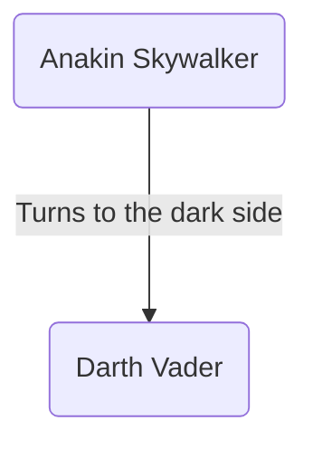

# BarnacleBoy

Welcome to the documentation of BarnacleBoy, the Python tool for making Mermaid diagrams. 

This project is still in very early stage of development, so expect anything and everything to change. 
But here's just an early teaser of what will be possible in the near future:

```python
from src.mermaid.flowchart import Flowchart

flowchart = Flowchart()
anakin = flowchart.create_node("Anakin Skywalker")
vader = flowchart.create_node("Darth Vader")
relationship = flowchart.create_relationship(
    [anakin, vader], label="Turns to the dark side"
)
flowchart.save_html("unnatural_powers.html")
```
results in an `html` file containing the following diagram:



The first goal of this project is to implement a wrapper for mermaid, such that any mermaid diagram
can be generated entirely through Python. Next, I intend to use this for automated documentation
of, for example, class relationships. 
